# School_District_Analysis

## Overview of the school district analysis:
* Initially I was tasked with doing a complete analysis for the school district regarding the test scores of 15 high schools. Once that analysis was completed, it was brought to my attention that there was some possible academic dishonesty, and it would need to be investigated. I removed the math and reading scores of the ninth-grade students at Thomas High School (THS). The analysis was then rerun, and this output will display which metrics changed, if any.

****! This report is discussing the changes that occurred from the initial analysis and the subsequent analysis.  !****

## Results

### The Differences

#### The District Summary - includes each student at each school and their respective math and reading scores.
* The removal of 9th grade scores affected every category. As you can there were drops in every category except for the average reading score, which remained at 81.9. Even the student count dropped, meaning they will no longer be accounted for in the new calculations.

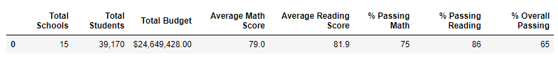
Original
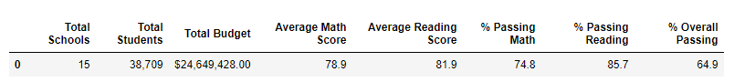
Challenge

#### The School Summary
* What I have here are three(3) versions of the per school data frame. Notice the Thomas high on each image. With only the scores removed you get the data from the 2nd image. 
* The before replacement image scores are in the 60s, because the metrics have not been recalculated to reflect the new student count.
* On the 3rd image all scores have been recalculated to reflect only 10th-12th grade
* Only the Thomas High data was modified, all other fields remain the same.

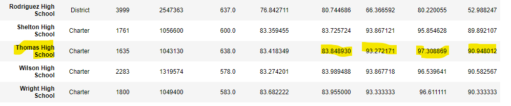 Original
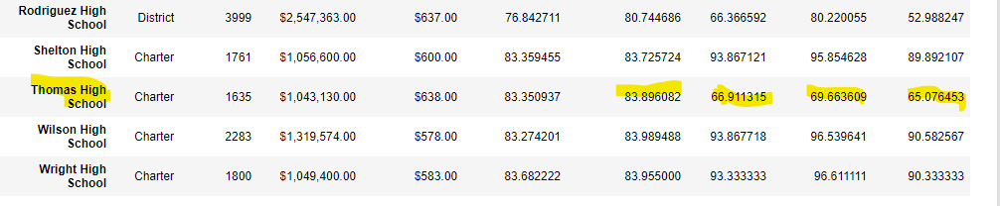 Before replacement
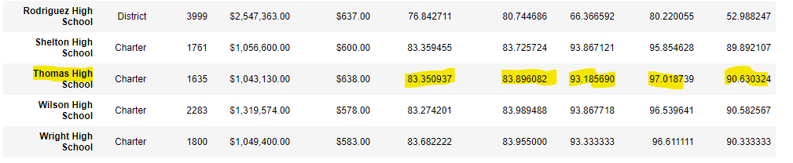 After Replacement

#### THS performance vs the other schools (with the ninth-grade scores were removed)

* Thomas High Schools' updated metrics did not change their ranking among the other schools

#### How did replacing the ninth-grade scores affect the following:

* Math and reading scores by grade no difference
  - With these metrics there was no change at all except for the 9th grade category at Thomas High where there is now a NaN in place for the reading and math scores.

Original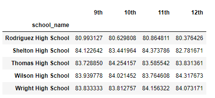

Challenge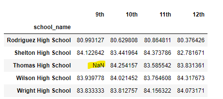

* Scores by school spending
  - Thomas was in the $630-644 per student group, therefore that was the only category that had a change. All metrics had a very slight decrease.

Original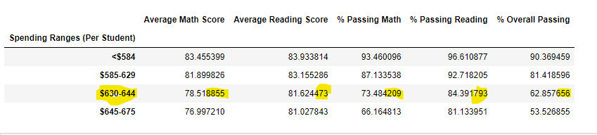

Challenge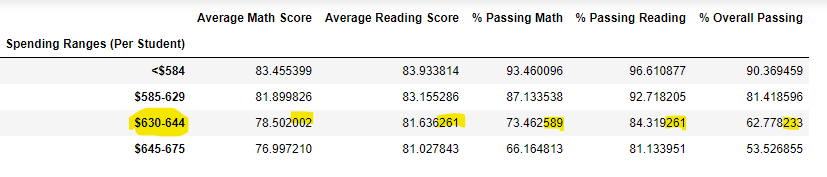

* Scores by school size
  - Thomas High was a medium sized school. All metrics decreased across the board.
Original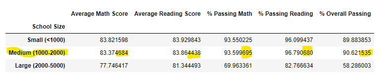

Challenge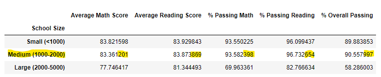

* Scores by school type  
  - Since Thomas High is a Charter school, that was the category that was modified by the deletion of the scores. The whole numbers were unchanged in either dataset, but the slight change is seen in the trailing decimal numbers.

Original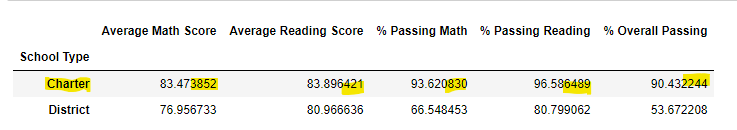

Challenge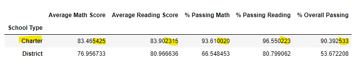

#### Summary - (Summarize four major changes in the updated school district analysis after reading and math scores for the ninth grade at Thomas High School have been replaced with NaNs.)

1. The total count of students was decreased and therefore affected calculations.
2. When comparing by school, the removal of the 9th grade scores improved the reading and math average scores as well as the percentages for THS.
3. Within the scores by school size, type, and spending all metrics decreased slightly or stayed the same.
4. The district was the main difference after the removal of the scores, but still they were not significant.
